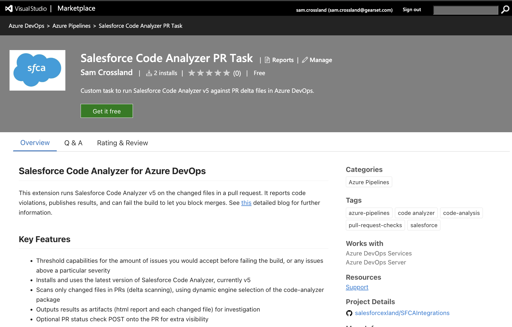
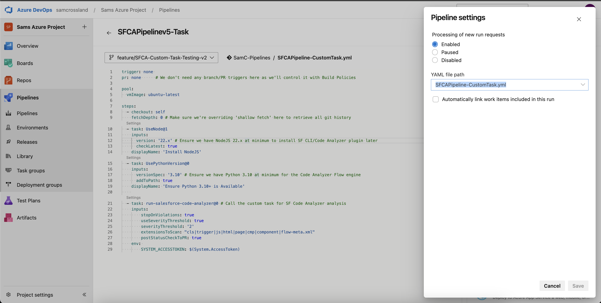
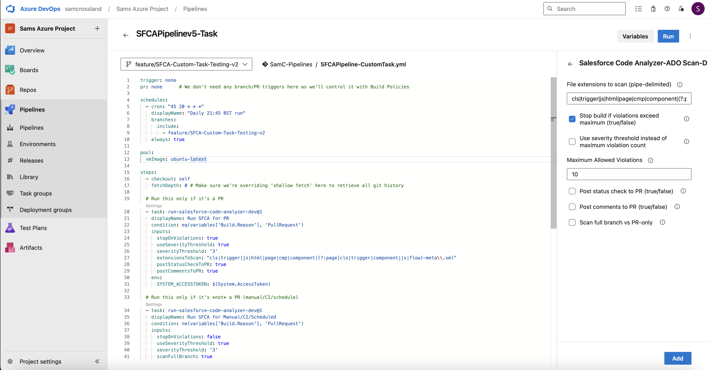
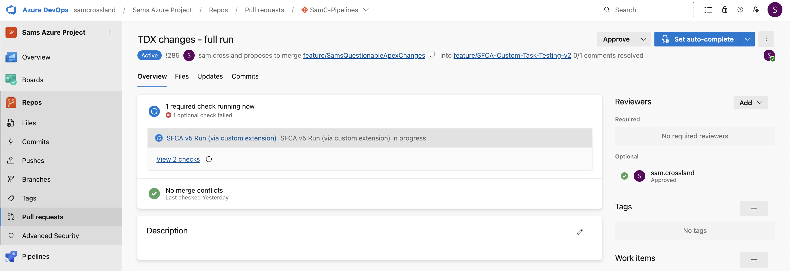
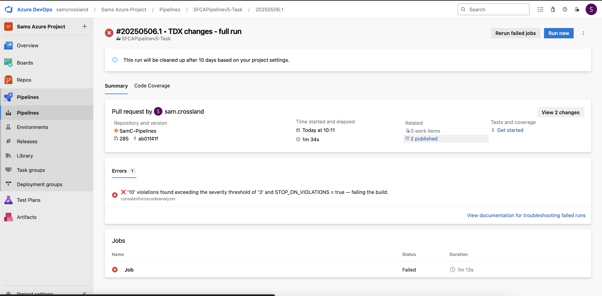
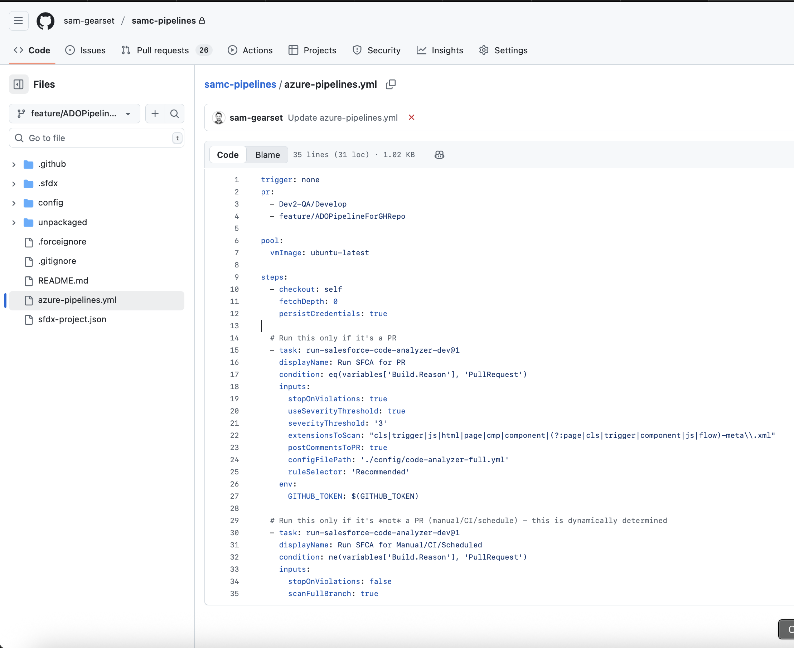
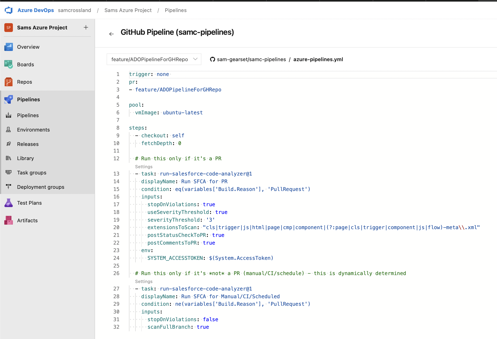
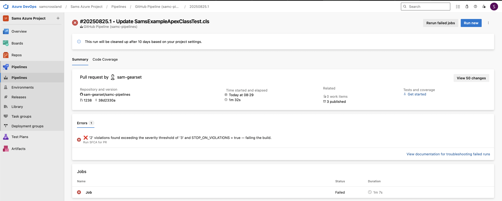

# Salesforce Code Analyzer - Azure DevOps PR Scan Task

This Azure DevOps [extension](https://marketplace.visualstudio.com/items?itemName=SamCrossland.salesforce-code-analyzer-ado-repos-task) provides a custom pipeline task that runs **Salesforce Code Analyzer v5** against PR-only delta changes, or full branches, in your Salesforce codebase. It supports configurable failure criteria, publishes scan artifacts, and optionally posts attributes back to the PR.

See [this](https://devopslaunchpad.com/blog/salesforce-code-analyzer/) detailed blog for further information.

---

## 🔍 What It Does

- Detects delta files in PRs (`cls`, `trigger`, `js`, `html`, `cmp`, `*-meta.xml`, etc.)
- Runs [Salesforce Code Analyzer v5](https://developer.salesforce.com/docs/platform/salesforce-code-analyzer/overview)
- Supports **two failure modes**:
  - Max total violations exceeded
  - Any violations exceeding a **severity threshold** (Info → Critical)
- Publishes HTML/JSON scan results and delta files as pipeline artifacts
- Optionally posts a **status check** to the PR with success/failure and/or **comments** summarising the results too

---

## ✅ Requirements

- Currently this extension works for Azure and GitHub Repositories (detail [here](#github-support)), linking into Azure Pipelines as the runner
- Pipeline must run on `ubuntu-latest`
- Node.js 20+ and Python 3.10+ must be available (these are already baked into ubuntu-latest, but you can explicitly check via `UseNode@1` and `UsePythonVersion@0` if necessary)
- PR build validation policies must be set up to control trigger behavior for ADO repos, or the 'pr' property for GitHub repos
- `checkout` step must override `fetchDepth` to 0 (no shallow fetching) for proper git diffing

---

## 🖥️ GitHub support
- You can also use a GitHub repository for the code, and ADO pipelines as the orchestration engine to run the scan and store the results
- To configure this, follow the necessary steps [here](https://learn.microsoft.com/en-us/azure/devops/pipelines/repos/github?view=azure-devops&tabs=yaml) to build an ADO Pipeline using the GitHub repo as the source, taking notes on the revelant permissions and .yml differences for PR triggers
- Also make sure `persistCredentials: true` is passed into the checkout step due to oddities in retrieving branches from GitHub for git diffing
- For the GitHub token, you need at least 'Read access to metadata' and 'Read and Write access to commit statuses and pull requests' for comments back to the PR, and to include it in the .yml as follows:

```yaml
env:
      GITHUB_TOKEN: $(GITHUB_TOKEN)
```

- See [screenshots](#️-screenshots) for more info

---

## 🧩 Task Inputs

| Name                   | Required      | Type     | Description |
|------------------------|---------------|----------|-------------|
| `extensionsToScan`     | No            | String   | Pipe-delimited list of file extensions to include, along with partnering -meta.xml files (default: `cls\|trigger\|js\|html\|page\|cmp\|component\|(\?:page\|cls\|trigger\|component\|js\|flow)-meta\\.xml`) |
| `stopOnViolations`     | No            | Boolean  | Whether to fail the build if violations exceed threshold (default: `true`) |
| `useSeverityThreshold` | No            | Boolean  | Use severity-based failure instead of total violation count |
| `severityThreshold`    | Only if `useSeverityThreshold` is true | PickList | Severity level to fail on (`1` = Critical → `5` = Info) |
| `maximumViolations`    | No            | Integer  | Max allowed violations before failing (default: `10`) |
| `configFilePath`       | No            | String   | Optional file path to the code-analyzer.yml file - further detail [here](#️-code-analyzeryml) |
| `ruleSelector`         | No            | String   | Optional string for custom tag/engine selections (default is 'Recommended') - further detail [here](#-rule-selector) |
| `postStatusCheckToPR`  | No            | Boolean  | Whether to POST a result status back to the PR (ADO REPOS ONLY) (default: `false`) |
| `postCommentsToPR`     | No            | Boolean  | Whether to POST a summary comment with link to results back to the PR (default: `false`) |
| `scanFullBranch`       | No            | Boolean  | Whether we want to run code analyzer against an entire branch rather than PR deltas (default: `false`) |

---

## 🗂️ Code Analyzer.yml
- With code analyzer v5, you can use a code-analyzer.yml configuration file (explained in detail [here](https://developer.salesforce.com/docs/platform/salesforce-code-analyzer/guide/config-custom.html)) to control engines, tags, severities, and much more
- This extension can leverage that custom configuration file in your scans for both PRs and full branch scans
- In testing I've placed this file in a 'config' folder at the root of the repository, and referenced it as so in the parameter './config/code-analyzer.yml' to grab the file and copy it into the runner for use, so make sure it's accessible
- See an example code analyzer file [here](/config/code-analyzer-full.yml)
- Certain **caveats** are below:
  - You need to ensure the code-analyzer.yml file is present on all branches relevant for PR/full scans, or it'll get skipped
  - Consider starting with the example yml files i've provided HERE, with example log/rule overrides
  - Ensure the `config_root:` property is left as `null` to allow dynamic passing of log outputs
  - There is currently a lack of support for extra config files (eslint, pmd etc) due to a relative path problem - this will be tackled in a future update
  - This could also contradict/cause confusion with the severity threshold and rule selector in terms of severities scanned and reported on

---

## 📏 Rule selector
- You can also customise which engines/rules/tags you want to run (explained in detail [here](https://developer.salesforce.com/docs/platform/salesforce-code-analyzer/guide/analyze.html#run-the-rules-on-your-code-base)) as part of the runner
- This extension defaults to the 'Recommended' tag across multiple engines, and the scanner dynamically determines which engines need to run based on this
- You can customise this to run particular engines (e.g pmd, eslint), particular tags (e.g Recommended, Security), a combination of engine/tag (e.g pmd:BestPractices), or include severity also (e.g cpd:Design:5)
- Certain **caveats** are below:
  - If you use the code-analyzer.yml file and severity threshold parameters, there may be discrepancies between the severities reported
  - If you select a particular tag, it could trigger unexpected engines if they're not disabled (e.g 'Apex' would trigger the 'sfge' graph engine)
  - If you pass in an incorrect value here, it won't cause the scanner to fail, and may just run with 0 rules (verify this in the logs)

---

## 🔐 Required Permissions

For ADO repos, if `postStatusCheckToPR` or `postCommentsToPR` are `true`, you must add the following to your pipeline YAML:

```yaml
env:
  SYSTEM_ACCESSTOKEN: $(System.AccessToken)
```
This allows the task to authenticate against the Azure DevOps API to post the result, as long as your build service user has the 'Contribute to Pull Requests' permission.

---

## 📁 Output

- Published artefacts on the Pipeline Build, including:
  - Results folder, containing Scan results in HTML: `SFCAv5Results.html` and JSON `SFCAv5Results.json` formats
  - Delta files scanned: Copied into artifact directory under 'scanned-delta-files'
  - Config folder containing code-analyzer.yml config file and other log outputs, if applicable
- Optional status/comments posted back to the source PR, if applicable

---

## Example usage - PRs (ADO)

```yaml 
trigger: none 
pr: none      # We don't need any branch/PR triggers here as we'll control it with Build Policies

pool:
  vmImage: ubuntu-latest

steps:
  - checkout: self
    fetchDepth: 0 # Make sure we're overriding 'shallow fetch' here to retrieve all git history
  # Custom task below handles package installs (dependencies are already present in ubuntu-latest), scanning, analysis and publishing of results
  - task: run-salesforce-code-analyzer@1 # Call the custom task for SF Code Analyzer analysis
    inputs:
        stopOnViolations: true
        useSeverityThreshold: true
        severityThreshold: '3'  # Moderate and above
        extensionsToScan: "cls|trigger|js|html|page|cmp|component|(?:page|cls|trigger|component|js|flow)-meta\\.xml" # Include meta xml files of these components to check for old versions
        postStatusCheckToPR: false
        postCommentsToPR: false
```

  - If you were to set `postStatusCheckToPR` or `postCommentsToPR` to be `true`, you need to make sure you pass in your SYSTEM_ACCESSTOKEN too so it can leverage your permissions to Contribute to Pull Requests.
  - An example is shown below for how you could do this, making sure you include any other relevant variables in the 'inputs':
```yaml
    inputs:
        postStatusCheckToPR: true
        postCommentsToPR: true
    env: 
        SYSTEM_ACCESSTOKEN: $(System.AccessToken)
```

## Example usage - Full branch scans & PRs (ADO, in 1 yml, using conditions, with a config file/rule selection)

```yaml 
trigger: none 
pr: none      # We don't need any branch/PR triggers here as we'll control it with Build Policies

schedules:
  - cron: "45 20 * * *" # Modify this accordingly to run on the right schedule
    displayName: "Daily 21:45 BST run"
    branches:
      include:
        - feature/SFCA-Custom-Task-Testing-v2 # Change this to be the full branch you want to scan, e.g 'main' or 'staging'
    always: true

pool:
  vmImage: ubuntu-latest

steps:
  - checkout: self
    fetchDepth: 0 # Make sure we're overriding 'shallow fetch' here to retrieve all git history

  # Run this only if it's a PR
  - task: run-salesforce-code-analyzer@1
    displayName: Run SFCA for PR
    condition: eq(variables['Build.Reason'], 'PullRequest')
    inputs:
      stopOnViolations: true
      useSeverityThreshold: true
      severityThreshold: '3'
      extensionsToScan: "cls|trigger|js|html|page|cmp|component|(?:page|cls|trigger|component|js|flow)-meta\\.xml"
      postStatusCheckToPR: true
      postCommentsToPR: true
      configFilePath: './config/code-analyzer-full.yml'
      ruleSelector: 'Recommended'
    env:
      SYSTEM_ACCESSTOKEN: $(System.AccessToken)

  # Run this only if it's *not* a PR (manual/CI/schedule) - this is dynamically determined
  - task: run-salesforce-code-analyzer@1
    displayName: Run SFCA for Manual/CI/Scheduled
    condition: ne(variables['Build.Reason'], 'PullRequest')
    inputs:
      stopOnViolations: false
      useSeverityThreshold: true
      severityThreshold: '3'
      scanFullBranch: true
```

## Example usage - Full branch scans & PRs (Github repo, in 1 yml, for PRs targeting the 'uat' branch)

```yaml 
trigger: none 
pr: 
  - uat

pool:
  vmImage: ubuntu-latest

steps:
  - checkout: self
    fetchDepth: 0
    persistCredentials: true

  # Run this only if it's a PR
  - task: run-salesforce-code-analyzer-dev@1
    displayName: Run SFCA for PR
    condition: eq(variables['Build.Reason'], 'PullRequest')
    inputs:
      stopOnViolations: true
      useSeverityThreshold: true
      severityThreshold: '3'
      extensionsToScan: "cls|trigger|js|html|page|cmp|component|(?:page|cls|trigger|component|js|flow)-meta\\.xml"
      postCommentsToPR: true
      configFilePath: './config/code-analyzer-full.yml'
      ruleSelector: 'Recommended'
    env:
      GITHUB_TOKEN: $(GITHUB_TOKEN)

  # Run this only if it's *not* a PR (manual/CI/schedule) - this is dynamically determined
  - task: run-salesforce-code-analyzer-dev@1
    displayName: Run SFCA for Manual/CI/Scheduled
    condition: ne(variables['Build.Reason'], 'PullRequest')
    inputs:
      stopOnViolations: false
      scanFullBranch: true
```

---

## 📚 Resources

- [Detailed blog](https://devopslaunchpad.com/blog/salesforce-code-analyzer/)
- [Salesforce Code Analyzer Docs](https://developer.salesforce.com/docs/platform/salesforce-code-analyzer/overview)
- [Submit an Issue](https://github.com/sam-gearset/SFCAIntegrations/issues)

## 🖥️ Screenshots

















---

## 📬 Contact
For questions, suggestions, or support, feel free to raise an issue, or reach out to me directly at: **crossland9221@gmail.com**
