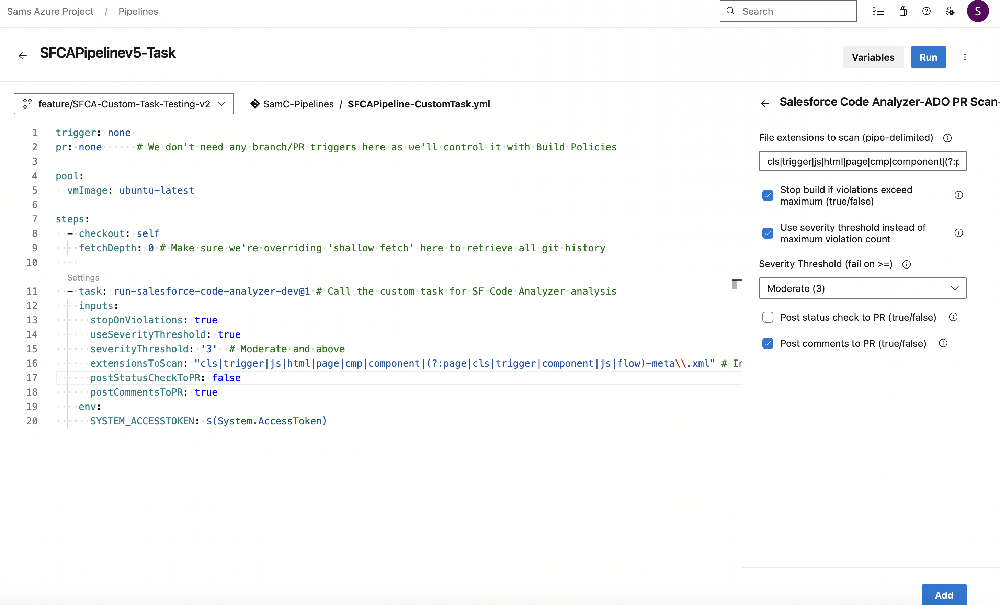

# Salesforce Code Analyzer - Azure DevOps PR Scan Task

This Azure DevOps [extension](https://marketplace.visualstudio.com/items?itemName=SamCrossland.salesforce-code-analyzer-ado-repos-task) provides a custom pipeline task that runs **Salesforce Code Analyzer v5** against PR-only delta changes in your Salesforce codebase. It supports configurable failure criteria, publishes scan artifacts, and optionally posts a status check back to the PR.

See [this](https://devopslaunchpad.com/blog/salesforce-code-analyzer/) detailed blog for further information.

---

## 🔍 What It Does

- Detects delta files in PRs (`cls`, `trigger`, `js`, `html`, `cmp`, `flow-meta.xml`, etc.)
- Runs [Salesforce Code Analyzer v5](https://developer.salesforce.com/docs/platform/salesforce-code-analyzer/overview)
- Supports **two failure modes**:
  - Max total violations exceeded
  - Any violations exceeding a **severity threshold** (Info → Critical)
- Publishes HTML scan results and delta files as pipeline artifacts
- Optionally posts a **status check** to the PR with success/failure

---

## ✅ Requirements

- Pipeline must run on `ubuntu-latest`
- Node.js 20+ and Python 3.10+ must be available (these are already baked into ubuntu-latest, but you can explicitly check via `UseNode@1` and `UsePythonVersion@0` if necessary)
- PR build validation policies must be set up to control trigger behavior
- `checkout` step must override `fetchDepth` to 0 (no shallow fetching) for proper git diffing

---

## 🧩 Task Inputs

| Name                   | Required      | Type     | Description |
|------------------------|---------------|----------|-------------|
| `maximumViolations`    | No            | Integer  | Max allowed violations before failing (default: `10`) |
| `stopOnViolations`     | No            | Boolean  | Whether to fail the build if violations exceed threshold (default: `true`) |
| `postStatusCheckToPR`  | No            | Boolean  | Whether to POST a result status back to the PR (default: `false`) |
| `extensionsToScan`     | No            | String   | Pipe-delimited list of file extensions to include (default: `cls\|trigger\|js\|html\|page\|cmp\|component\|flow-meta.xml`) |
| `useSeverityThreshold` | No            | Boolean  | Use severity-based failure instead of total violation count |
| `severityThreshold`    | Only if `useSeverityThreshold` is true | PickList | Severity level to fail on (`1` = Critical → `5` = Info) |

---

## 🔐 Required Permissions

If `postStatusCheckToPR` or `postCommentsToPR` are `true`, you must add the following to your pipeline YAML:

```yaml
env:
  SYSTEM_ACCESSTOKEN: $(System.AccessToken)
```
This allows the task to authenticate against the Azure DevOps API to post the result, as long as your build service user has the 'Contribute to Pull Requests' permission.

---

## 📁 Output

- Published artefacts on the Pipeline Build, including:
- Scan results HTML: `SFCAv5Results.html`
- Scan results JSON: `SFCAv5Results.json`
- Delta files scanned: Copied into artifact directory under 'scanned-delta-files'
- Optional status posted back to the source PR if necessary

---

## 🧪 Example Usage

```yaml 
trigger: none
pr: none  # We'll trigger this pipeline via branch policy for PRs

pool:
  vmImage: ubuntu-latest

steps:
  - checkout: self
    fetchDepth: 0 # Make sure we're overriding 'shallow fetch' here to retrieve all git history
  # Custom task below handles package installs (dependencies are already present in ubuntu-latest), scanning, analysis and publishing of results
  - task: run-salesforce-code-analyzer@1 
    inputs:
      stopOnViolations: true
      useSeverityThreshold: true
      severityThreshold: '3'  # Moderate and above
      extensionsToScan: "cls|trigger|js|html|page|cmp|component|(?:page|cls|trigger|component|js|flow)-meta\\.xml" # Include meta xml files of these components to check for old versions
      postStatusCheckToPR: false
      postCommentsToPR: true
    env:
      SYSTEM_ACCESSTOKEN: $(System.AccessToken)
```

```yaml
trigger: none # We don't want this to run on pushes to branches, only PRs and Scheduled full branch runs
pr: none      # Enforced with branch policy

schedules:
  - cron: "45 20 * * *"
    displayName: "Daily 21:45pm BST run"
    branches:
      include:
        - main # TODO: Remember this will take that branches .yml file version, so ensure it's consistent across branches.
    always: true

pool:
  vmImage: ubuntu-latest

steps:
  - checkout: self
    fetchDepth: 0

  # Run this only if it's a PR
  - task: run-salesforce-code-analyzer@1
    displayName: Run SFCA for PR
    condition: eq(variables['Build.Reason'], 'PullRequest')
    inputs:
      stopOnViolations: true
      useSeverityThreshold: true
      severityThreshold: '3'
      extensionsToScan: "cls|trigger|js|html|page|cmp|component|(?:page|cls|trigger|component|js|flow)-meta\\.xml"
      postStatusCheckToPR: true
      postCommentsToPR: true
    env:
      SYSTEM_ACCESSTOKEN: $(System.AccessToken)

  # Run this only if it's *not* a PR (manual/CI/schedule)
  - task: run-salesforce-code-analyzer@1
    displayName: Run SFCA for Manual/CI/Scheduled
    condition: ne(variables['Build.Reason'], 'PullRequest')
    inputs:
      stopOnViolations: false
      useSeverityThreshold: true
      severityThreshold: '3'
      extensionsToScan: "cls|trigger|js|html|page|cmp|component|(?:page|cls|trigger|component|js|flow)-meta\\.xml"
      postStatusCheckToPR: false
      postCommentsToPR: false
    env:
      SYSTEM_ACCESSTOKEN: $(System.AccessToken)
```

---

## 📚 Resources

- [Detailed blog](https://devopslaunchpad.com/blog/salesforce-code-analyzer/)
- [Salesforce Code Analyzer Docs](https://developer.salesforce.com/docs/platform/salesforce-code-analyzer/overview)
- [Submit an Issue](https://github.com/sam-gearset/SFCAIntegrations/issues)

## 🖥️ Screenshots





---

## 📬 Contact
For questions, suggestions, or support, feel free to reach out directly: **crossland9221@gmail.com**