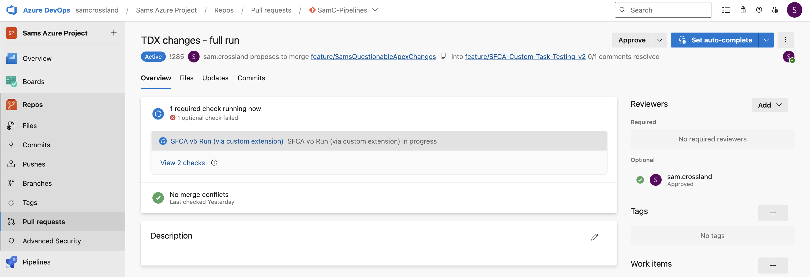
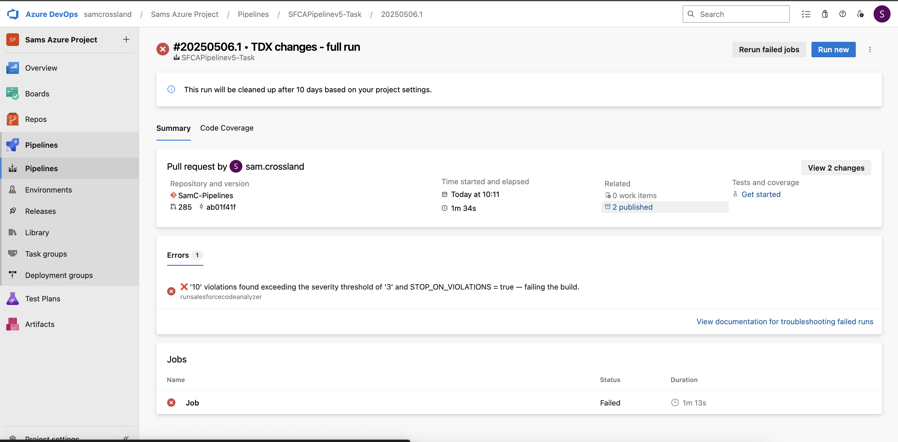

# Salesforce Code Analyzer for Azure DevOps

This extension allows you to run Salesforce Code Analyzer v5 on the changed files in a pull request, or against an entire branch. It reports code violations, publishes results, and can fail the build to let you block merges or identify technical debt in your overall codebase. It follows a fail fast approach if there's no relevant files and skips the rest of the logic, gives you artifacts to analyse after a valid run, and provides detailed logs and feedback to that PR once complete.

**NOTE: This extension only currently functions for Azure DevOps Services (Cloud), and NOT Azure DevOps Server (On prem)**

## Key Features

- Threshold capabilities for the amount of issues you would accept before failing the build, or any issues above a particular severity
- Installs and uses the latest version of Salesforce Code Analyzer, currently v5
- Scans an entire selected branch (as a one-off or scheduled run using cron) if desired
- Can also scan only changed files in PRs (delta scanning), using dynamic engine selection of the code-analyzer package
- Outputs results as artifacts (html report, json file, and each changed file) for investigation
- Optional PR status check POST onto the PR for extra visibility





## Requirements

- Azure DevOps (Cloud only), with an available build agent and permissions to configure the pipeline
- Pipeline must run on `ubuntu-latest`
- Node.js 20+ and Python 3.10+ must be available (these are already baked into ubuntu-latest, but you can explicitly check via `UseNode@1` and `UsePythonVersion@0` if necessary)
- `checkout` step must override `fetchDepth` to 0 (no shallow fetching) for proper git diffing (if running on PRs)
- Pull request build validation setup using a .yml file (present on all relevant branches) and ADO Build Policies/Schedules to trigger it
- Your build user having 'Contribute to pull requests' permission if using the 'postStatusCheckToPR' option (if running on PRs)

## Usage

1. Install this extension in your Azure DevOps organization.
2. Add the task `Salesforce Code Analyzer - ADO Scan` to a YAML or Classic build pipeline, using the below example.
3. Assess parameters like `maximumViolations` or `postStatusCheckToPR` to create the right combination for your checks, as outlined below.
4. Consider whether you'd like SFCA to run on PRs only, full branches, or a combination of both (second example)
5. Consider if you would like to fail builds on total violations, or any issues above a particular severity threshold as outlined [here](https://developer.salesforce.com/docs/atlas.en-us.sfdx_cli_reference.meta/sfdx_cli_reference/cli_reference_code-analyzer_commands_unified.htm#:~:text=t%20%7C%20%2D%2D-,severity,-%2Dthreshold%20SEVERITY%2DTHRESHOLD).
   - I'd recommend using the 'useSeverityThreshold' capability to be much more specific around what types of violation you'd like to fail builds on, rather than total violations.

## Task Inputs

| Name                   | Required      | Type     | Description |
|------------------------|---------------|----------|-------------|
| `extensionsToScan`     | No            | String   | Pipe-delimited list of file extensions to include, along with partnering -meta.xml files (default: `cls\|trigger\|js\|html\|page\|cmp\|component\|(\?:page\|cls\|trigger\|component\|js\|flow)-meta\\.xml`) |
| `stopOnViolations`     | No            | Boolean  | Whether to fail the build if violations exceed threshold (default: `true`) |
| `useSeverityThreshold` | No            | Boolean  | Use severity-based failure instead of total violation count |
| `severityThreshold`    | Only if `useSeverityThreshold` is true | PickList | Severity level to fail on (`1` = Critical → `5` = Info) |
| `maximumViolations`    | No            | Integer  | Max allowed violations before failing (default: `10`) |
| `postStatusCheckToPR`  | No            | Boolean  | Whether to POST a result status back to the PR (default: `false`) |
| `postCommentsToPR`  | No            | Boolean  | Whether to POST a summary comment with link to results back to the PR (default: `false`) |
| `scanFullBranch`  | No            | Boolean  | Whether we want to run code analyzer against an entire branch rather than PR deltas (default: `false`) |

## Example usage - PRs

```yaml 
trigger: none 
pr: none      # We don't need any branch/PR triggers here as we'll control it with Build Policies

pool:
  vmImage: ubuntu-latest

steps:
  - checkout: self
    fetchDepth: 0 # Make sure we're overriding 'shallow fetch' here to retrieve all git history
  # Custom task below handles package installs (dependencies are already present in ubuntu-latest), scanning, analysis and publishing of results
  - task: run-salesforce-code-analyzer@1 # Call the custom task for SF Code Analyzer analysis
    inputs:
        stopOnViolations: true
        useSeverityThreshold: true
        severityThreshold: '3'  # Moderate and above
        extensionsToScan: "cls|trigger|js|html|page|cmp|component|(?:page|cls|trigger|component|js|flow)-meta\\.xml" # Include meta xml files of these components to check for old versions
        postStatusCheckToPR: false
        postCommentsToPR: false
```

  - If you were to set `postStatusCheckToPR` or `postCommentsToPR` to be `true`, you need to make sure you pass in your SYSTEM_ACCESSTOKEN too so it can leverage your permissions to Contribute to Pull Requests.
  - An example is shown below for how you could do this, making sure you include any other relevant variables in the 'inputs':
```yaml
    inputs:
        postStatusCheckToPR: true
        postCommentsToPR: true
    env: 
        SYSTEM_ACCESSTOKEN: $(System.AccessToken)
```

## Example usage - Full branch scans & PRs (in 1 yml, using conditions)

```yaml 
trigger: none 
pr: none      # We don't need any branch/PR triggers here as we'll control it with Build Policies

schedules:
  - cron: "45 20 * * *" # Modify this accordingly to run on the right schedule
    displayName: "Daily 21:45 BST run"
    branches:
      include:
        - feature/SFCA-Custom-Task-Testing-v2 # Change this to be the full branch you want to scan, e.g 'main' or 'staging'
    always: true

pool:
  vmImage: ubuntu-latest

steps:
  - checkout: self
    fetchDepth: 0 # Make sure we're overriding 'shallow fetch' here to retrieve all git history

  # Run this only if it's a PR
  - task: run-salesforce-code-analyzer-dev@1
    displayName: Run SFCA for PR
    condition: eq(variables['Build.Reason'], 'PullRequest')
    inputs:
      stopOnViolations: true
      useSeverityThreshold: true
      severityThreshold: '3'
      extensionsToScan: "cls|trigger|js|html|page|cmp|component|(?:page|cls|trigger|component|js|flow)-meta\\.xml"
      postStatusCheckToPR: true
      postCommentsToPR: true
    env:
      SYSTEM_ACCESSTOKEN: $(System.AccessToken)

  # Run this only if it's *not* a PR (manual/CI/schedule) - this is dynamically determined
  - task: run-salesforce-code-analyzer-dev@1
    displayName: Run SFCA for Manual/CI/Scheduled
    condition: ne(variables['Build.Reason'], 'PullRequest')
    inputs:
      stopOnViolations: false
      useSeverityThreshold: true
      severityThreshold: '3'
      scanFullBranch: true
```

## Links
- [Blog covering wider context and implementation guidance](https://devopslaunchpad.com/blog/salesforce-code-analyzer/)
- [GitHub Repo](https://github.com/salesforcexland/SFCAIntegrations)
- [Salesforce Code Analyzer Docs](https://developer.salesforce.com/docs/platform/salesforce-code-analyzer/overview)
- [Submit an Issue](https://github.com/salesforcexland/SFCAIntegrations/issues)

## 📬 Contact
For questions, suggestions, or support, feel free to reach out directly: **crossland9221@gmail.com**